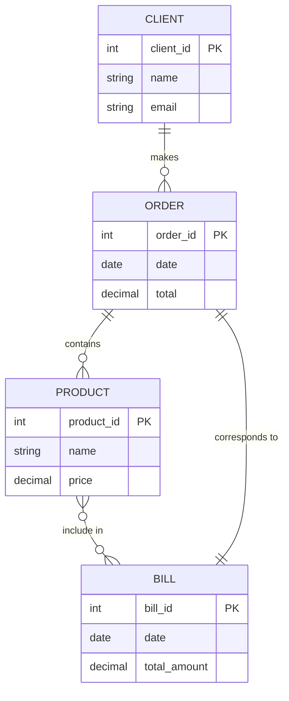

# Example #1 Online Orders Data Base

## Entity/Relation Diagram

This is a Spring Boot project to initialize a database with the following Entity-Relationship model design:

## Some others details

**IDE:** IntelliJ Community 2024.2.1

**Spring boot initializer:** https://start.spring.io/

**Dependencies:**

- Spring Web
- Spring Data JPA
- Lombok
- Spring Boot Started Test => https://mvnrepository.com/artifact/org.springframework.boot/spring-boot-starter-test/3.3.4
- PostgreSQL Driver
- Jakarta Persistence => https://mvnrepository.com/artifact/jakarta.persistence/jakarta.persistence-api/3.2.0

**Aplication Properties** template for PostgeSQL databases

- spring.jpa.properties.hibernate.dialect=org.hibernate.dialect.PostgreSQLDialect
- spring.jpa.hibernate.ddl-auto=create
- spring.jpa.hibernate.show-sql=true
- spring.datasource.url=jdbc:postgresql://localhost:5432/orders
- spring.datasource.username=postgres
- spring.datasource.password=admin
